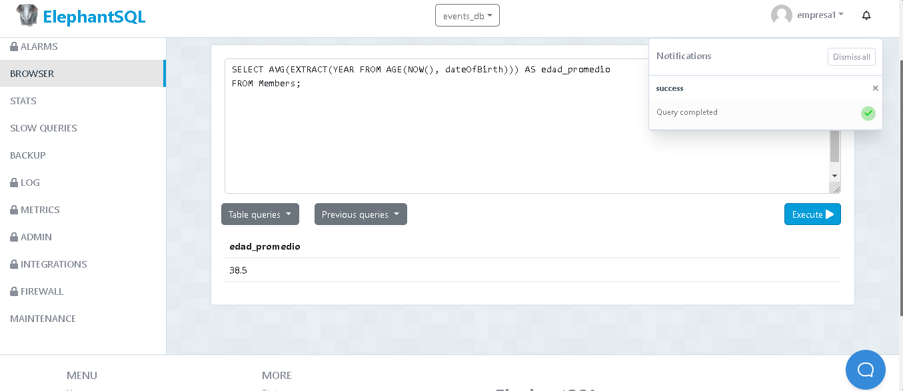
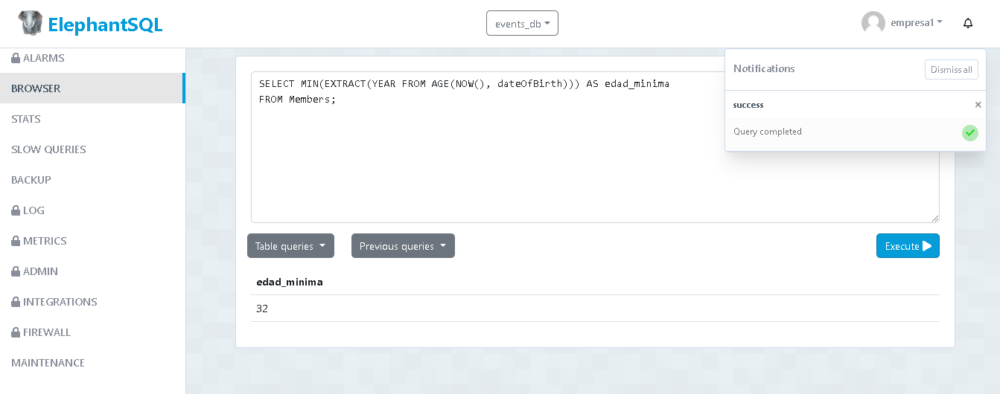
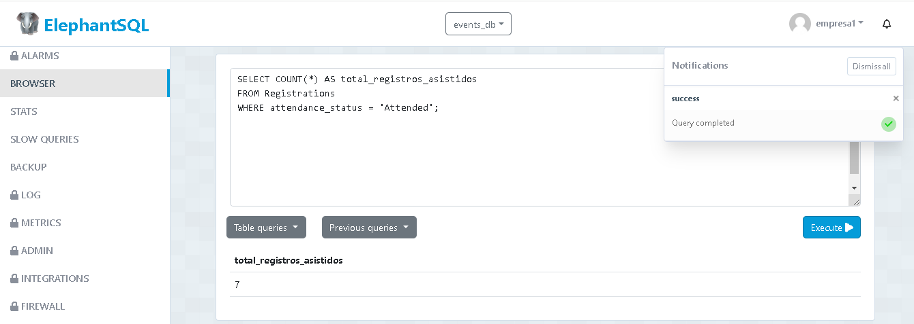
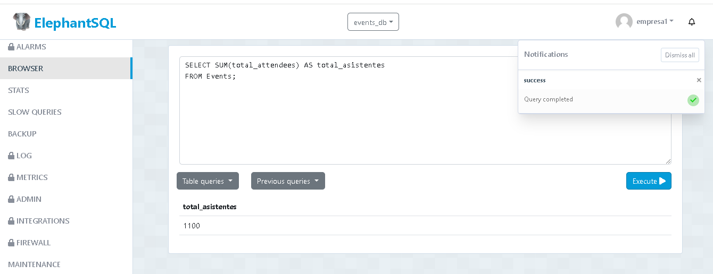
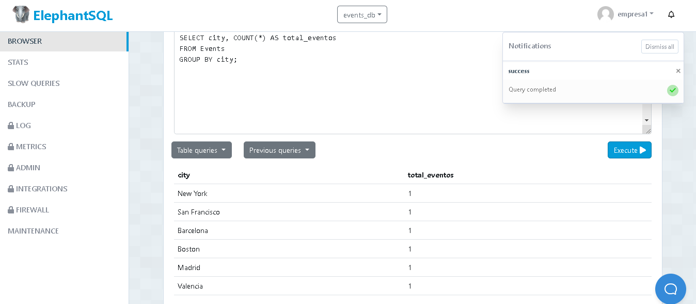
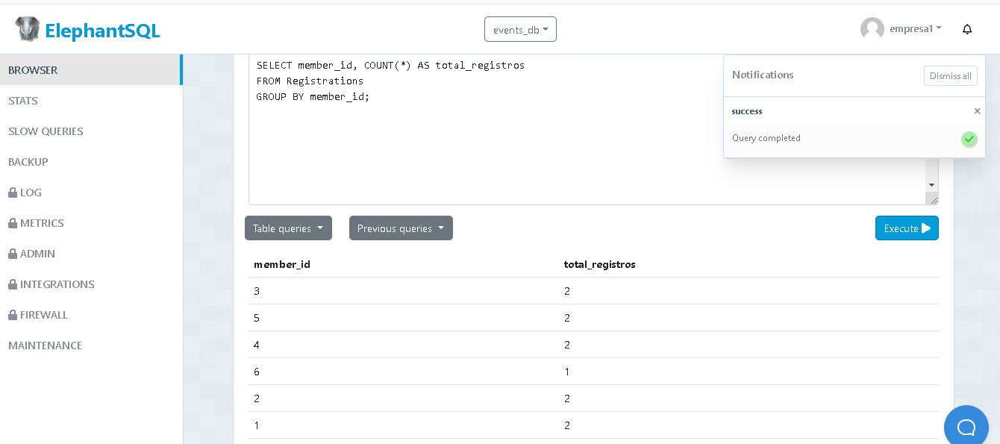
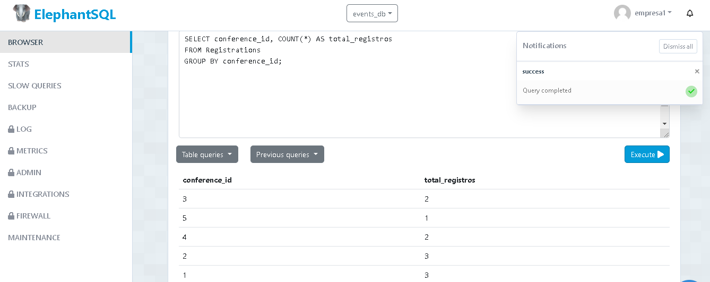

obtener la edad promedio de los miembros:
  - Sentencia:
 SELECT AVG(EXTRACT(YEAR FROM AGE(NOW(), dateOfBirth))) AS edad_promedio
FROM Members;

<img src="" 

obtener la edad mínima de los miembros:
  - Sentencia:
 SELECT MIN(EXTRACT(YEAR FROM AGE(NOW(), dateOfBirth))) AS edad_minima
FROM Members;
<img src="" 

obtener el número total de registros asistidos:
  - Sentencia:
 SELECT COUNT(*) AS total_registros_asistidos
FROM Registrations
WHERE attendance_status = 'Attended';
<img src="" 

obtener el número total de asistentes a todas las conferencias
  - Sentencia:
SELECT SUM(total_attendees) AS total_asistentes
FROM Events;
<img src="" 

obtener el número total de eventos por cada ciudad:
  - Sentencia:
SELECT city, COUNT(*) AS total_eventos
FROM Events
GROUP BY city;
<img src=")" 

obtener el número de registros por cada miembro:
  - Sentencia:
SELECT member_id, COUNT(*) AS total_registros
FROM Registrations
GROUP BY member_id;
<img src="" 

obtener el número de registros por cada conferencia:
  - Sentencia:
SELECT conference_id, COUNT(*) AS total_registros
FROM Registrations
GROUP BY conference_id;
<img src="" 

